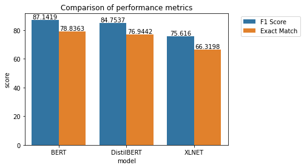
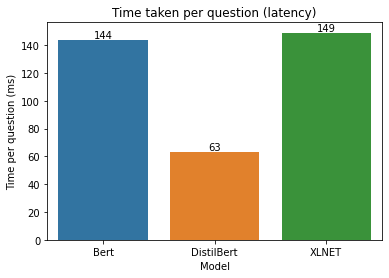

### Question-Answering on SQUAD


```python
# Import relevant libraries.
import torch
from huggingface_hub import notebook_login
import transformers
from datasets import load_dataset, load_metric
```


```python
notebook_login()
```


    VBox(children=(HTML(value='<center> 
  <thead>
    <tr style="text-align: right;">
      <th></th>
      <th>id</th>
      <th>title</th>
      <th>context</th>
      <th>question</th>
      <th>answers</th>
    </tr>
  </thead>
  <tbody>
    <tr>
      <th>0</th>
      <td>572f7193947a6a140053c973</td>
      <td>Database</td>
      <td>Just as the navigational approach would require programs to loop in order to collect records, the relational approach would require loops to collect information about any one record. Codd's solution to the necessary looping was a set-oriented language, a suggestion that would later spawn the ubiquitous SQL. Using a branch of mathematics known as tuple calculus, he demonstrated that such a system could support all the operations of normal databases (inserting, updating etc.) as well as providing a simple system for finding and returning sets of data in a single operation.</td>
      <td>What type of math was used to create a system to find data sets?</td>
      <td>{'text': ['tuple calculus'], 'answer_start': [348]}</td>
    </tr>
    <tr>
      <th>1</th>
      <td>5727ada7ff5b5019007d9268</td>
      <td>Political_party</td>
      <td>In fledgling democracies funding can also be provided by foreign aid. International donors provide financing to political parties in developing countries as a means to promote democracy and good governance. Support can be purely financial or otherwise. Frequently it is provided as capacity development activities including the development of party manifestos, party constitutions and campaigning skills. Developing links between ideologically linked parties is another common feature of international support for a party. Sometimes this can be perceived as directly supporting the political aims of a political party, such as the support of the US government to the Georgian party behind the Rose Revolution. Other donors work on a more neutral basis, where multiple donors provide grants in countries accessible by all parties for various aims defined by the recipients. There have been calls by leading development think-tanks, such as the Overseas Development Institute, to increase support to political parties as part of developing the capacity to deal with the demands of interest-driven donors to improve governance.</td>
      <td>What can also be provided by foreign aid?</td>
      <td>{'text': ['funding'], 'answer_start': [25]}</td>
    </tr>
    <tr>
      <th>2</th>
      <td>57324b720fdd8d15006c6923</td>
      <td>Protestantism</td>
      <td>In Congregational and Presbyterian churches which profess a traditionally Calvinist or Reformed theology there are differing views regarding present-day continuation or cessation of the gifts (charismata) of the Spirit. Generally, however, Reformed charismatics distance themselves from renewal movements with tendencies which could be perceived as overemotional, such as Word of Faith, Toronto Blessing, Brownsville Revival and Lakeland Revival. Prominent Reformed charismatic denominations are the Sovereign Grace Churches and the Every Nation Churches in the USA, in Great Britain there is the Newfrontiers churches and movement, which leading figure is Terry Virgo.</td>
      <td>Who heads the Newfrontiers movement?</td>
      <td>{'text': ['Terry Virgo'], 'answer_start': [657]}</td>
    </tr>
    <tr>
      <th>3</th>
      <td>5726fa4bdd62a815002e96b0</td>
      <td>Napoleon</td>
      <td>After the fall of Napoleon, not only was Napoleonic Code retained by conquered countries including the Netherlands, Belgium, parts of Italy and Germany, but has been used as the basis of certain parts of law outside Europe including the Dominican Republic, the US state of Louisiana and the Canadian province of Quebec. The memory of Napoleon in Poland is favorable, for his support for independence and opposition to Russia, his legal code, the abolition of serfdom, and the introduction of modern middle class bureaucracies.</td>
      <td>One reason Poland views Napoleon favorably is due to his abolition of what form of indentured servitude?</td>
      <td>{'text': ['serfdom'], 'answer_start': [459]}</td>
    </tr>
  </tbody>
</table>


### Preprocessing the data

The SQUAD dataset contains inputs in the form of title, context, question and answers. Here's the important inputs to be considered:

- Context: Paragraph where the answers to the questions are going to be found (if any)
- Question: Question asked, based on the context from the paragraph
- Answers: Annotated answers from the paragraph, with answer text, start index of the answer.

We need to convert these texts inputs into suitable vectors/tensors, which are fed into the models BERT, DistilBERT and XLNET. This conversion includes tokenization of the questions and answers. 

However, because we choose to only fine-tune BERT, DistilBERT and XLNET for SQUAD dataset, we have to retrieve the pretrained model checkpoints and the vocabulary used for pretraining these models. This can be retrieved using the HuggingFace transformers module.

For each of the model, we need to retrieve an independent tokenizer: BertTokenizer, XLNetTokenizer, DistilBertTokenizer
The reason behind different tokenization technique is because each of these models have been pre-trained based on different vocabulary and checkpoints (weights and biases). At the high level, the operations in a tokenizer include:
- Stripping whitespace characters
- Truncating and padding for identifying questions, answers and context

The outputs of tokenizer are used as inputs to the models.

### Converting text into Word Embeddings with Tokenizers

Consider the following example of a context and a question by BertTokenizer. It converts the context into a list of tokens.


```python
from utils_squad import (get_squad_example_object, convert_example_to_model_inputs, write_predictions)
from transformers import (BertConfig, BertForQuestionAnswering, BertTokenizer)

context = "Steven Paul Jobs (February 24, 1955 – October 5, 2011) was an American entrepreneur, industrial designer, business magnate, media proprietor, and investor. He was the co-founder, the chairman, and CEO of Apple; the chairman and majority shareholder of Pixar; a member of The Walt Disney Company's board of directors following its acquisition of Pixar; and the founder, chairman, and CEO of NeXT. He is widely recognized as a pioneer of the personal computer revolution of the 1970s and 1980s, along with his early business partner and fellow Apple co-founder Steve Wozniak."
question = 'Who is the founder of Apple?'
tokenizer = BertTokenizer.from_pretrained(pretrained_model_name_or_path='./Final_Checkpoints_Bert/Tokenizer', do_lower_case=True)
print(tokenizer.tokenize(context))
```

    ['steven', 'paul', 'jobs', '(', 'february', '24', ',', '1955', '–', 'october', '5', ',', '2011', ')', 'was', 'an', 'american', 'entrepreneur', ',', 'industrial', 'designer', ',', 'business', 'magnate', ',', 'media', 'proprietor', ',', 'and', 'investor', '.', 'he', 'was', 'the', 'co', '-', 'founder', ',', 'the', 'chairman', ',', 'and', 'ceo', 'of', 'apple', ';', 'the', 'chairman', 'and', 'majority', 'shareholder', 'of', 'pi', '##xa', '##r', ';', 'a', 'member', 'of', 'the', 'walt', 'disney', 'company', "'", 's', 'board', 'of', 'directors', 'following', 'its', 'acquisition', 'of', 'pi', '##xa', '##r', ';', 'and', 'the', 'founder', ',', 'chairman', ',', 'and', 'ceo', 'of', 'next', '.', 'he', 'is', 'widely', 'recognized', 'as', 'a', 'pioneer', 'of', 'the', 'personal', 'computer', 'revolution', 'of', 'the', '1970s', 'and', '1980s', ',', 'along', 'with', 'his', 'early', 'business', 'partner', 'and', 'fellow', 'apple', 'co', '-', 'founder', 'steve', 'wo', '##z', '##nia', '##k', '.']
    


```python
# Each question, answer and context pair is converted into a squad example object, with ID, question text.

examples = get_squad_example_object(context, question)
examples
```


    qas_id: 0, question_text: Who is the founder of Apple?, doc_tokens: [Steven Paul Jobs (February 24, 1955 – October 5, 2011) was an American entrepreneur, industrial designer, business magnate, media proprietor, and investor. He was the co-founder, the chairman, and CEO of Apple; the chairman and majority shareholder of Pixar; a member of The Walt Disney Company's board of directors following its acquisition of Pixar; and the founder, chairman, and CEO of NeXT. He is widely recognized as a pioneer of the personal computer revolution of the 1970s and 1980s, along with his early business partner and fellow Apple co-founder Steve Wozniak.]


```python
features = convert_example_to_model_inputs(examples, tokenizer, 384, 128, 64)
all_input_ids = torch.tensor([f.input_ids for f in features], dtype=torch.long)
all_input_mask = torch.tensor([f.input_mask for f in features], dtype=torch.long)
all_segment_ids = torch.tensor([f.segment_ids for f in features], dtype=torch.long)
all_example_index = torch.arange(all_input_ids.size(0), dtype=torch.long)

# Final vector embedding for the Squad example object.
print(all_input_ids)
print(all_input_mask)
print(all_segment_ids)
print(all_example_index)
```

    tensor([[  101,  2040,  2003,  1996,  3910,  1997,  6207,  1029,   102,  7112,
              2703,  5841,  1006,  2337,  2484,  1010,  3982,  1516,  2255,  1019,
              1010,  2249,  1007,  2001,  2019,  2137, 10670,  1010,  3919,  5859,
              1010,  2449, 27470,  1010,  2865, 21584,  1010,  1998, 14316,  1012,
              2002,  2001,  1996,  2522,  1011,  3910,  1010,  1996,  3472,  1010,
              1998,  5766,  1997,  6207,  1025,  1996,  3472,  1998,  3484, 18668,
              1997, 14255, 18684,  2099,  1025,  1037,  2266,  1997,  1996, 10598,
              6373,  2194,  1005,  1055,  2604,  1997,  5501,  2206,  2049,  7654,
              1997, 14255, 18684,  2099,  1025,  1998,  1996,  3910,  1010,  3472,
              1010,  1998,  5766,  1997,  2279,  1012,  2002,  2003,  4235,  3858,
              2004,  1037,  7156,  1997,  1996,  3167,  3274,  4329,  1997,  1996,
              3955,  1998,  3865,  1010,  2247,  2007,  2010,  2220,  2449,  4256,
              1998,  3507,  6207,  2522,  1011,  3910,  3889, 24185,  2480,  6200,
              2243,  1012,   102,     0,     0,     0,     0,     0,     0,     0,
                 0,     0,     0,     0,     0,     0,     0,     0,     0,     0,
                 0,     0,     0,     0,     0,     0,     0,     0,     0,     0,
                 0,     0,     0,     0,     0,     0,     0,     0,     0,     0,
                 0,     0,     0,     0,     0,     0,     0,     0,     0,     0,
                 0,     0,     0,     0,     0,     0,     0,     0,     0,     0,
                 0,     0,     0,     0,     0,     0,     0,     0,     0,     0,
                 0,     0,     0,     0,     0,     0,     0,     0,     0,     0,
                 0,     0,     0,     0,     0,     0,     0,     0,     0,     0,
                 0,     0,     0,     0,     0,     0,     0,     0,     0,     0,
                 0,     0,     0,     0,     0,     0,     0,     0,     0,     0,
                 0,     0,     0,     0,     0,     0,     0,     0,     0,     0,
                 0,     0,     0,     0,     0,     0,     0,     0,     0,     0,
                 0,     0,     0,     0,     0,     0,     0,     0,     0,     0,
                 0,     0,     0,     0,     0,     0,     0,     0,     0,     0,
                 0,     0,     0,     0,     0,     0,     0,     0,     0,     0,
                 0,     0,     0,     0,     0,     0,     0,     0,     0,     0,
                 0,     0,     0,     0,     0,     0,     0,     0,     0,     0,
                 0,     0,     0,     0,     0,     0,     0,     0,     0,     0,
                 0,     0,     0,     0,     0,     0,     0,     0,     0,     0,
                 0,     0,     0,     0,     0,     0,     0,     0,     0,     0,
                 0,     0,     0,     0,     0,     0,     0,     0,     0,     0,
                 0,     0,     0,     0,     0,     0,     0,     0,     0,     0,
                 0,     0,     0,     0,     0,     0,     0,     0,     0,     0,
                 0,     0,     0,     0,     0,     0,     0,     0,     0,     0,
                 0,     0,     0,     0]])
    tensor([[1, 1, 1, 1, 1, 1, 1, 1, 1, 1, 1, 1, 1, 1, 1, 1, 1, 1, 1, 1, 1, 1, 1, 1,
             1, 1, 1, 1, 1, 1, 1, 1, 1, 1, 1, 1, 1, 1, 1, 1, 1, 1, 1, 1, 1, 1, 1, 1,
             1, 1, 1, 1, 1, 1, 1, 1, 1, 1, 1, 1, 1, 1, 1, 1, 1, 1, 1, 1, 1, 1, 1, 1,
             1, 1, 1, 1, 1, 1, 1, 1, 1, 1, 1, 1, 1, 1, 1, 1, 1, 1, 1, 1, 1, 1, 1, 1,
             1, 1, 1, 1, 1, 1, 1, 1, 1, 1, 1, 1, 1, 1, 1, 1, 1, 1, 1, 1, 1, 1, 1, 1,
             1, 1, 1, 1, 1, 1, 1, 1, 1, 1, 1, 1, 1, 0, 0, 0, 0, 0, 0, 0, 0, 0, 0, 0,
             0, 0, 0, 0, 0, 0, 0, 0, 0, 0, 0, 0, 0, 0, 0, 0, 0, 0, 0, 0, 0, 0, 0, 0,
             0, 0, 0, 0, 0, 0, 0, 0, 0, 0, 0, 0, 0, 0, 0, 0, 0, 0, 0, 0, 0, 0, 0, 0,
             0, 0, 0, 0, 0, 0, 0, 0, 0, 0, 0, 0, 0, 0, 0, 0, 0, 0, 0, 0, 0, 0, 0, 0,
             0, 0, 0, 0, 0, 0, 0, 0, 0, 0, 0, 0, 0, 0, 0, 0, 0, 0, 0, 0, 0, 0, 0, 0,
             0, 0, 0, 0, 0, 0, 0, 0, 0, 0, 0, 0, 0, 0, 0, 0, 0, 0, 0, 0, 0, 0, 0, 0,
             0, 0, 0, 0, 0, 0, 0, 0, 0, 0, 0, 0, 0, 0, 0, 0, 0, 0, 0, 0, 0, 0, 0, 0,
             0, 0, 0, 0, 0, 0, 0, 0, 0, 0, 0, 0, 0, 0, 0, 0, 0, 0, 0, 0, 0, 0, 0, 0,
             0, 0, 0, 0, 0, 0, 0, 0, 0, 0, 0, 0, 0, 0, 0, 0, 0, 0, 0, 0, 0, 0, 0, 0,
             0, 0, 0, 0, 0, 0, 0, 0, 0, 0, 0, 0, 0, 0, 0, 0, 0, 0, 0, 0, 0, 0, 0, 0,
             0, 0, 0, 0, 0, 0, 0, 0, 0, 0, 0, 0, 0, 0, 0, 0, 0, 0, 0, 0, 0, 0, 0, 0]])
    tensor([[0, 0, 0, 0, 0, 0, 0, 0, 0, 1, 1, 1, 1, 1, 1, 1, 1, 1, 1, 1, 1, 1, 1, 1,
             1, 1, 1, 1, 1, 1, 1, 1, 1, 1, 1, 1, 1, 1, 1, 1, 1, 1, 1, 1, 1, 1, 1, 1,
             1, 1, 1, 1, 1, 1, 1, 1, 1, 1, 1, 1, 1, 1, 1, 1, 1, 1, 1, 1, 1, 1, 1, 1,
             1, 1, 1, 1, 1, 1, 1, 1, 1, 1, 1, 1, 1, 1, 1, 1, 1, 1, 1, 1, 1, 1, 1, 1,
             1, 1, 1, 1, 1, 1, 1, 1, 1, 1, 1, 1, 1, 1, 1, 1, 1, 1, 1, 1, 1, 1, 1, 1,
             1, 1, 1, 1, 1, 1, 1, 1, 1, 1, 1, 1, 1, 0, 0, 0, 0, 0, 0, 0, 0, 0, 0, 0,
             0, 0, 0, 0, 0, 0, 0, 0, 0, 0, 0, 0, 0, 0, 0, 0, 0, 0, 0, 0, 0, 0, 0, 0,
             0, 0, 0, 0, 0, 0, 0, 0, 0, 0, 0, 0, 0, 0, 0, 0, 0, 0, 0, 0, 0, 0, 0, 0,
             0, 0, 0, 0, 0, 0, 0, 0, 0, 0, 0, 0, 0, 0, 0, 0, 0, 0, 0, 0, 0, 0, 0, 0,
             0, 0, 0, 0, 0, 0, 0, 0, 0, 0, 0, 0, 0, 0, 0, 0, 0, 0, 0, 0, 0, 0, 0, 0,
             0, 0, 0, 0, 0, 0, 0, 0, 0, 0, 0, 0, 0, 0, 0, 0, 0, 0, 0, 0, 0, 0, 0, 0,
             0, 0, 0, 0, 0, 0, 0, 0, 0, 0, 0, 0, 0, 0, 0, 0, 0, 0, 0, 0, 0, 0, 0, 0,
             0, 0, 0, 0, 0, 0, 0, 0, 0, 0, 0, 0, 0, 0, 0, 0, 0, 0, 0, 0, 0, 0, 0, 0,
             0, 0, 0, 0, 0, 0, 0, 0, 0, 0, 0, 0, 0, 0, 0, 0, 0, 0, 0, 0, 0, 0, 0, 0,
             0, 0, 0, 0, 0, 0, 0, 0, 0, 0, 0, 0, 0, 0, 0, 0, 0, 0, 0, 0, 0, 0, 0, 0,
             0, 0, 0, 0, 0, 0, 0, 0, 0, 0, 0, 0, 0, 0, 0, 0, 0, 0, 0, 0, 0, 0, 0, 0]])
    tensor([0])
    

### Training & Evaluating the models [BERT, DistilBERT, XLNET]

Given computational time and memory constraints, we trained these models on GPUs in the Northeastern HPC server. The following are the command are used to train the models:

```python
python train.py --model 'bert'

python train.py --model 'distilbert'

python train.py --model 'xlnet'
```

For evaluation, the following commands are used (in which the checkpoints, pytorch trained models and tokenizers are required to be placed in the same directory):

```python

python evaluate.py --model 'bert'

python evaluate.py --model 'distilbert'

python evaluate.py --model 'xlnet'
```

### Compare the F1-scores and Exact Matches


```python
# Paths for evaluated F1 scores and Exact Matches.
import os
import json

results_dir = os.path.join('./results')
bert_results = json.load(open(os.path.join(results_dir, 'Bert', 'result.json')))
distil_bert_results = json.load(open(os.path.join(results_dir, 'DistilBert', 'result.json')))
xlnet_bert_results = json.load(open(os.path.join(results_dir, 'Xlnet', 'result.json')))
results = [bert_results, distil_bert_results, xlnet_bert_results]

print(bert_results)
print(distil_bert_results)
print(xlnet_bert_results)
```

    {'exact': 78.83632923368023, 'f1': 87.14188452907673, 'total': 10570, 'HasAns_exact': 78.83632923368023, 'HasAns_f1': 87.14188452907673, 'HasAns_total': 10570}
    {'exact': 76.9441816461684, 'f1': 84.7536956876441, 'total': 10570, 'HasAns_exact': 76.9441816461684, 'HasAns_f1': 84.7536956876441, 'HasAns_total': 10570}
    {'exact': 66.3197729422895, 'f1': 75.61597400828245, 'total': 10570, 'HasAns_exact': 66.3197729422895, 'HasAns_f1': 75.61597400828245, 'HasAns_total': 10570}
    


```python
# Create a dataframe with the results.
f1_df = pd.DataFrame(columns=['model', 'score'])
f1_df['model'] = ['BERT', 'DistilBERT', 'XLNET']
f1_df['score'] = [result['f1'] for result in results]
f1_df['Metric'] = 'F1 Score'

em_df = pd.DataFrame(columns=['model', 'score'])
em_df['model'] = ['BERT', 'DistilBERT', 'XLNET']
em_df['score'] = [result['exact'] for result in results]
em_df['Metric'] = 'Exact Match'

final_df = pd.concat([f1_df, em_df])
final_df
```


<div>
<style scoped>
    .dataframe tbody tr th:only-of-type {
        vertical-align: middle;
    }

    .dataframe tbody tr th {
        vertical-align: top;
    }

    .dataframe thead th {
        text-align: right;
    }
</style>
<table border="1" class="dataframe">
  <thead>
    <tr style="text-align: right;">
      <th></th>
      <th>model</th>
      <th>score</th>
      <th>Metric</th>
    </tr>
  </thead>
  <tbody>
    <tr>
      <th>0</th>
      <td>BERT</td>
      <td>87.141885</td>
      <td>F1 Score</td>
    </tr>
    <tr>
      <th>1</th>
      <td>DistilBERT</td>
      <td>84.753696</td>
      <td>F1 Score</td>
    </tr>
    <tr>
      <th>2</th>
      <td>XLNET</td>
      <td>75.615974</td>
      <td>F1 Score</td>
    </tr>
    <tr>
      <th>0</th>
      <td>BERT</td>
      <td>78.836329</td>
      <td>Exact Match</td>
    </tr>
    <tr>
      <th>1</th>
      <td>DistilBERT</td>
      <td>76.944182</td>
      <td>Exact Match</td>
    </tr>
    <tr>
      <th>2</th>
      <td>XLNET</td>
      <td>66.319773</td>
      <td>Exact Match</td>
    </tr>
  </tbody>
</table>
</div>


```python
# Plot a bar graph.
import seaborn as sns
import matplotlib.pyplot as plt
ax = sns.barplot(x = 'model', y = 'score', hue = 'Metric', data = final_df)
ax.bar_label(ax.containers[0])
ax.bar_label(ax.containers[1])
lgd = plt.legend(bbox_to_anchor=(1.05, 1))
plt.title('Comparison of performance metrics')
plt.savefig('metrics-comparison.png', bbox_extra_artists=(lgd,), bbox_inches='tight')
plt.show()
```


    

    


Here's a few inferences from the result above:

1. We can clearly see that the performance of BERT is the best among the three models, with DistilBERT almost behind BERT.
2. As the number of epochs increase, we suppose that XLNET performs better to achieve higher scores.

### Compare the latency of each model


```python
from qa_system import *
import time

# Test question:
context = "Steve Jobs was an American entrepreneur, industrial designer, business magnate and investor. \
           He was widely recognized as a pioneer of the personal computer revolution of the 1970s and 1980s,\
           along with his early business partner and fellow Apple co-founder Steve Wozniak.\
           He was born on 24th February 1955 in San Francisco. He and Wozniak co-founded Apple \
           in 1976 to sell Wozniak's Apple I personal computer. The Macintosh introduced the desktop \
           publishing industry in 1985 with the addition of the Apple LaserWriter, the first laser printer\
           to feature vector graphics."
question = "who co-founded Apple?"

# Test BERT model speed.
bert_start = time.time()
model = Model(
    model_type = 'bert',
    model_path = './Final_Checkpoints_Bert',
    tokenizer_path = './Final_Checkpoints_Bert/tokenizer')
bert_answer = model.predict(context, question)
bert_end = time.time()
print('Time taken for answering by BERT: ', bert_end - bert_start)

# Test DistilBERT model speed.
dbert_start = time.time()
model = Model(
    model_type = 'bert',
    model_path = './Final_Checkpoints_DistilBert',
    tokenizer_path = './Final_Checkpoints_DistilBert/tokenizer')
dbert_answer = model.predict(context, question)
dbert_end = time.time()
print('Time taken for answering by DistilBert BERT: ', dbert_end - dbert_start)

# Test XLNET model speed.
xlnet_start = time.time()
model = Model(
    model_type = 'bert',
    model_path = './Final_Checkpoints_Bert',
    tokenizer_path = './Final_Checkpoints_Bert/tokenizer')
xlnet_answer = model.predict(context, question)
xlnet_end = time.time()
print('Time taken for answering by XLNET: ', xlnet_end - xlnet_start)

# Create a DataFrame with the time for each method.
latency_df = pd.DataFrame()
latency_df['Model'] = ['Bert', 'DistilBert', 'XLNET']
latency_df['Time per question (ms)'] = [int((bert_end-bert_start) * 100), int((dbert_end-dbert_start) * 100), int((xlnet_end-xlnet_start) * 100)]
latency_df
```

    Time taken for answering by BERT:  2.560497283935547
    Time taken for answering by DistilBert BERT:  0.9830152988433838
    Time taken for answering by XLNET:  2.484772205352783
    


<div>
<style scoped>
    .dataframe tbody tr th:only-of-type {
        vertical-align: middle;
    }

    .dataframe tbody tr th {
        vertical-align: top;
    }

    .dataframe thead th {
        text-align: right;
    }
</style>
<table border="1" class="dataframe">
  <thead>
    <tr style="text-align: right;">
      <th></th>
      <th>Model</th>
      <th>Time per question (ms)</th>
    </tr>
  </thead>
  <tbody>
    <tr>
      <th>0</th>
      <td>Bert</td>
      <td>256</td>
    </tr>
    <tr>
      <th>1</th>
      <td>DistilBert</td>
      <td>98</td>
    </tr>
    <tr>
      <th>2</th>
      <td>XLNET</td>
      <td>248</td>
    </tr>
  </tbody>
</table>
</div>


```python
ax = sns.barplot(x = 'Model', y = 'Time per question (ms)', data = latency_df)
ax.bar_label(ax.containers[0])
plt.title('Time taken per question (latency)')
plt.savefig('latency.png')
plt.show()
```


    

    


From the graph above, we can see that clearly DistilBert is the fastest among the models to provide answer for a question with a context. This also conforms with the concept of knowledge distillation and makes DistilBERT model an ideal model for high latency requirements, such as search engines or chat-bots / personal assistants.

### Comparison for test question, context and answer


```python
context = "Steve Jobs was an American entrepreneur, industrial designer, business magnate and investor. \
           He was widely recognized as a pioneer of the personal computer revolution of the 1970s and 1980s,\
           along with his early business partner and fellow Apple co-founder Steve Wozniak.\
           He was born on 24th February 1955 in San Francisco. He and Wozniak co-founded Apple \
           in 1976 to sell Wozniak's Apple I personal computer. The Macintosh introduced the desktop \
           publishing industry in 1985 with the addition of the Apple LaserWriter, the first laser printer\
           to feature vector graphics."
question = "who co-founded Apple?"

print('Answer from bert:', bert_answer['answer'])
print('Answer from distilbert:', dbert_answer['answer'])
print('Answer from xlnet:', xlnet_answer['answer'])
```

    Answer from bert: Steve Wozniak
    Answer from distilbert: Steve Wozniak
    Answer from xlnet: Steve Wozniak
    

We can clearly see that the models are producing similar answers to the same question.


```python

```
